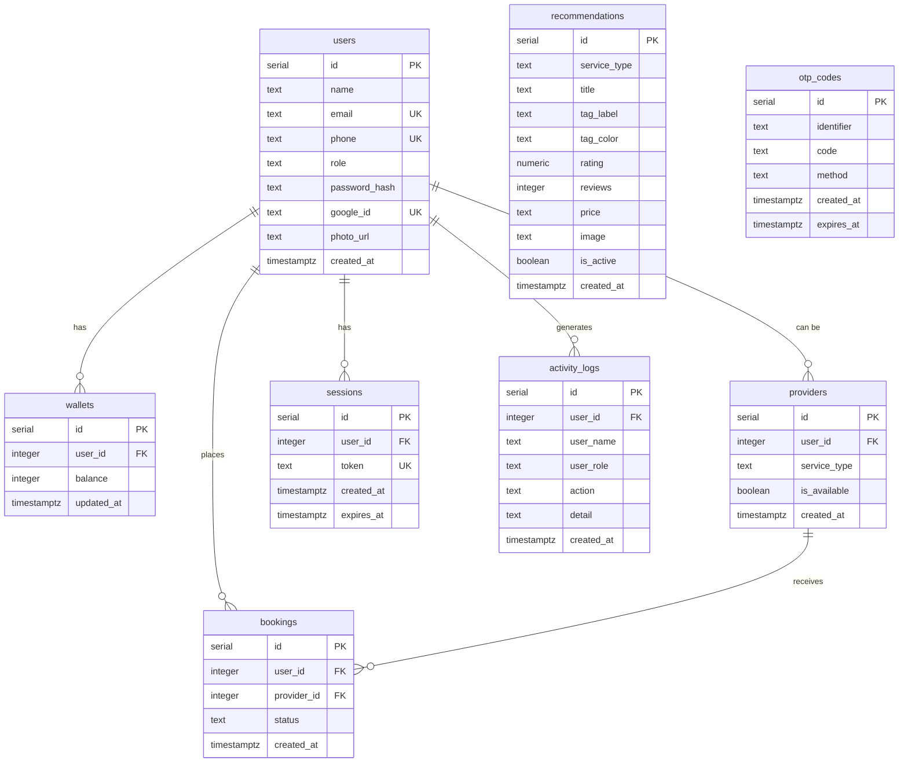

# Architecture — CareGo Healthcare Platform

> Hackathon Edition — Garuda Hacks  
> Last updated: 2026-07-16

---

## System Overview

```
┌──────────────────────────────────────────────────────────────────┐
│                         CLIENTS                                  │
│                                                                  │
│  ┌─────────────┐   ┌─────────────────┐   ┌─────────────────┐    │
│  │  Flutter     │   │  Frontend Web   │   │  Admin Dashboard │    │
│  │  Mobile App  │   │  (Vite+React)   │   │  (Vite+React)    │    │
│  │  (Android)   │   │  Port 5173      │   │  Port 5174       │    │
│  └──────┬───────┘   └──────┬──────────┘   └──────┬───────────┘    │
│         │ HTTP              │ HTTP                │ HTTP          │
└─────────┼──────────────────┼───────────────────────┼──────────────┘
          │                  │                       │
          ▼                  ▼                       ▼
┌──────────────────────────────────────────────────────────────────┐
│                    ENCORE.TS BACKEND                              │
│                    Port 4000 (local)                              │
│                                                                  │
│  ┌──────────┐ ┌──────────┐ ┌───────────┐ ┌──────────────┐       │
│  │   auth   │ │   user   │ │ ambulance │ │    admin     │       │
│  │ service  │ │ service  │ │  service  │ │   service    │       │
│  └────┬─────┘ └────┬─────┘ └─────┬─────┘ └──────┬───────┘       │
│       │            │              │               │              │
│  ┌──────────┐ ┌──────────┐ ┌──────────┐                         │
│  │ caregiver│ │  rental  │ │   app    │                         │
│  │ service  │ │ service  │ │ service  │                         │
│  └────┬─────┘ └────┬─────┘ └────┬─────┘                         │
│       │            │             │                               │
│       ▼            ▼             ▼                               │
│  ┌──────────────────────────────────────────────────────┐       │
│  │              PostgreSQL 15 (Encore-managed)           │       │
│  │  Database: "carego"                                   │       │
│  └──────────────────────────────────────────────────────┘       │
│                                                                  │
│  ┌────────────────┐                                              │
│  │  WAHA (Docker)  │  WhatsApp OTP delivery                      │
│  │  Port 3000      │  Via HTTP API                               │
│  └────────────────┘                                              │
└──────────────────────────────────────────────────────────────────┘
```

---

## Backend Services

| Service | Directory | Endpoints | Description |
|---------|-----------|-----------|-------------|
| `auth` | `backend/auth/` | 8 | Login, register, OTP, Google OAuth, sessions |
| `user` | `backend/user/` | 2 | Wallet balance, profile update |
| `ambulance` | `backend/ambulance/` | 3 | Booking, tracking placeholder, recommendations |
| `admin` | `backend/admin/` | 4 | CRUD users, CRUD recommendations, activity logs |
| `caregiver` | `backend/caregiver/` | TBD | Caregiver listing, search, booking |
| `rental` | `backend/rental/` | TBD | Equipment catalog, booking |
| `app` | `backend/app/` | 1 | App version check |

Each service has two core files:
- `encore.service.ts` — Service registration with Encore runtime
- `api.ts` — Endpoint definitions using `api()` wrapper

---

## Database Schema



---

## Key Design Decisions

| Decision | Choice | Rationale |
|----------|--------|-----------|
| Backend framework | Encore.ts | Zero-config PostgreSQL, auto API clients, one-command deploy |
| Mobile framework | Flutter (Dart) | Native Android perf, hot reload, strong Indonesian ecosystem |
| Auth mechanism | Custom session tokens | Simpler than JWT for prototype; immediate revocation |
| OTP delivery | WAHA (WhatsApp) | 90% WhatsApp penetration in Indonesia; free & self-hosted |
| Geocoding | OpenStreetMap (Nominatim + OSRM) | Free, no API key needed |
| Photo storage | Base64 in DB | Fastest prototype path (tech debt — migrate before prod) |
| State management | `setState` + SharedPreferences | Adequate for ~16 screens (tech debt if scaling) |

---

## Deployment

| Component | Target | Trigger |
|-----------|--------|---------|
| Backend | Encore Cloud (staging) | `git push origin main` → auto-deploy |
| Frontend Web | Vercel/Netlify (manual) | `bun run build` → upload `dist/` |
| Admin Dashboard | Vercel/Netlify (manual) | `bun run build` → upload `dist/` |
| Flutter App | APK distribution | `flutter build apk --release` |
| WAHA | Docker (local dev only) | `docker-compose up -d` |
